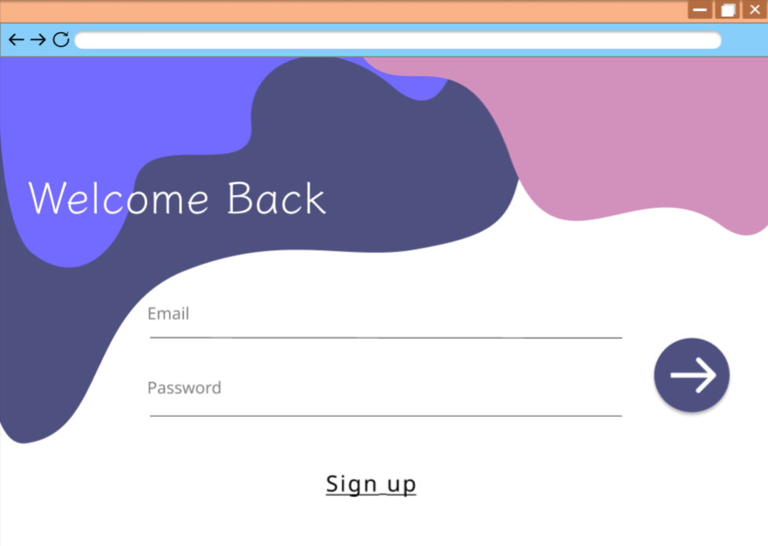
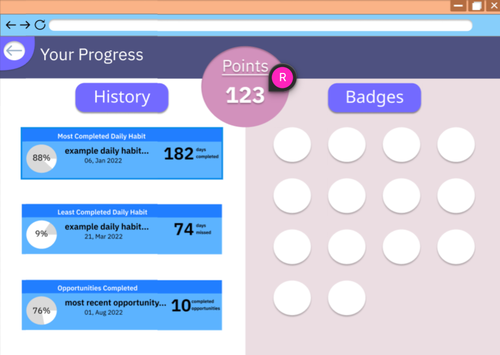

# Project Planning
For this assignment, you'll create some initial plans for your project.

## Assignment Description
[Project Planning Assignment](https://education.launchcode.org/liftoff/modules/assignments/project-planning)

## Submission Instructions

### Wireframes

I wasn't the one to create these wireframes, it was Raven, but we all agreed that these were ideal.

### Project Tracker

Here is the **[Trello board](https://trello.com/b/uH9NEjBx/liftoff)**.

### Project Repo Link

We split the project into two different repos until we can tie them together later. 

**[Back-end](https://github.com/Jul-2022-LC-LiftOff/HabitYouHeard)**

**[Front-end](https://github.com/Jul-2022-LC-LiftOff/Habit-You-Heard-Frontend)**